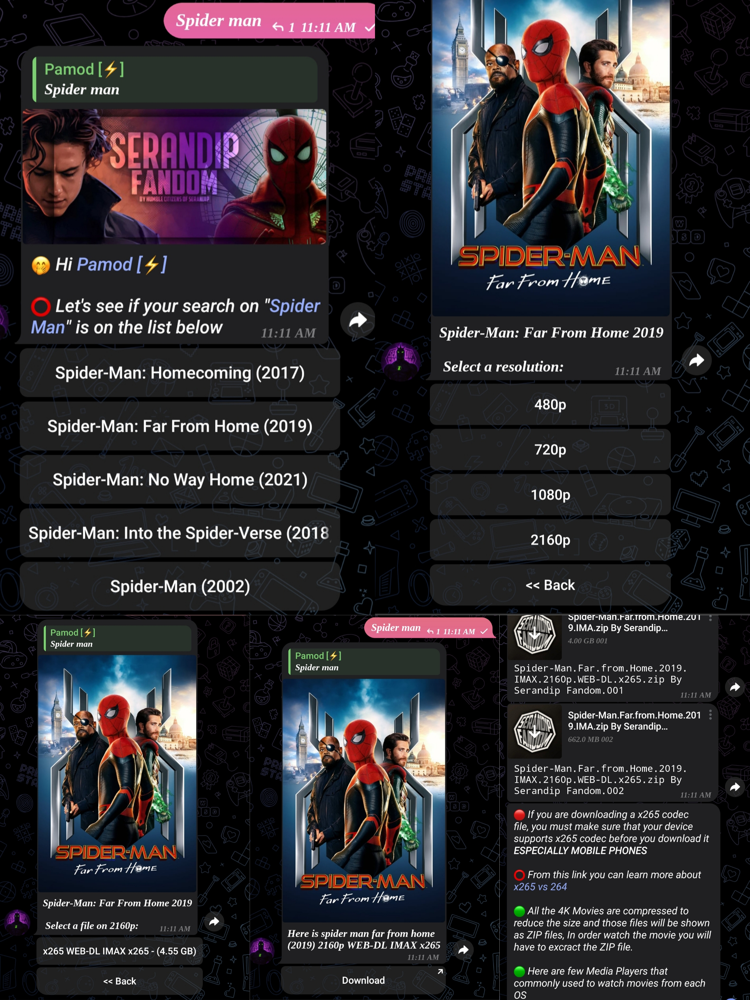

# 🎬 Serandip Prime — The Ultimate Telegram Movie Bot

> **Your all-in-one Telegram assistant for movies, moderation, downloads, and more.**

---

## 🚀 Features

### 🎥 Movie Management & Search

* Smart search by title, resolution, and codec
* Inline filters for quick navigation
* Multi-part handling (`.001`, `.002`) made clean
* Personalization: remembers user preferences

### 🔧 Group & Channel Management

* Full moderation control (ban, mute, warn, restrict, flood control)
* Welcome/goodbye messages with custom templates
* Admin commands and role-based permissions
* Smart auto-reply and filter system
* Anti-spam and raid protection

### 🎬 Social Media Downloader

* Download from YouTube, Instagram, TikTok, Twitter, Facebook, and more
* Supports video, audio, reels, and shorts
* Automatic link detection and processing in groups

### 🔤 Font Customizer

* Transform text into fancy fonts/styles
* Multiple font packs for creative expression
* Works in commands, replies, and inline messages

### 🌐 Web Interface (WIP)

* Manage movie collection, logs, and settings from your browser
* Google Sign-In support for admin authentication
* Separate user profiles and admin dashboards

### 🔁 Auto Restart & Logging

* Scheduled log dump and bot health checks
* Automatic recovery on crash
* Logs sent to a private channel

---

## 💡 Why Serandip Prime?

* Built on top of **Pyrogram** — fast, async, and reliable
* Modular and scalable codebase
* Prioritizes reliability and user control
* Smooth user experience with minimal clutter
* Perfect for both **movie enthusiasts** and **Telegram group admins**

---

## 🧠 Tech Stack

* Python 🐍
* Pyrogram
* MongoDB (Movie collection & personalization)
* SQLite (Pluggable DB for other modules)
* Scheduler + AsyncIO
* Custom font engine
* Dynamic plugin loader

---

## ⚙️ Deployment

Clone this repo:

```bash
git clone https://github.com/yourusername/serandip-prime.git
cd serandip-prime
```

---

## 🔑 Environment Setup

Copy `.env.example` to `.env` and configure:

```env
APP_NAME=YourBotName
WEB_APP=https://your-web-app-url
API_ID=GetFromMyTelegramOrg
API_HASH=GetFromMyTelegramOrg
TOKEN1=YourBotFatherToken
TOKEN2=OptionalBotToken
TOKEN3=OptionalBotToken
OWNER=YourTelegramUserID
TIME_ZONE=Asia/Colombo
LOGS=-1001234567890
MOVIE=-1001234567890
MOVIE_GRP=-1001234567890
FILTER_CHAT=-1001234567890
DATABASE_URL=YourMongoDBConnectionURI
```

### 🔐 Google OAuth Setup (Optional)

To enable Google Sign-In for the web interface:

1. Go to [Google Cloud Console](https://console.cloud.google.com/)
2. Create a new project or select an existing one
3. Enable the Google+ API
4. Go to "Credentials" and create an OAuth 2.0 Client ID
5. Set authorized redirect URIs to include:
   - `http://localhost:8000/auth/google` (for local development)
   - `https://yourdomain.com/auth/google` (for production)
6. Add the following to your `.env` file:
   ```env
   GOOGLE_CLIENT_ID=your-google-client-id.apps.googleusercontent.com
   GOOGLE_CLIENT_SECRET=your-google-client-secret
   AUTHORIZED_ADMIN_EMAILS=admin@example.com,user1@example.com
   ```

The `AUTHORIZED_ADMIN_EMAILS` variable should contain a comma-separated list of email addresses that should have admin access to the dashboard.

---

## ▶️ Run the Bot

```bash
sudo chmod +x install.sh

./install.sh
```

### 🛠 Service Management

After running the installation script, you can manage your bot service using the convenient `prime` command:

```bash
# Check service status
prime status

# Start the service
prime start

# Stop the service
prime stop

# Restart the service
prime restart

# View real-time logs
prime logs

# Show help
prime help
```

The `prime` command provides a much simpler and more intuitive way to manage your Serandip Prime Telegram bot service compared to traditional `systemctl` commands.

Sit back, relax, and let Serandip Prime handle the chaos. 🍿

---

## 📸 Preview

<p align="center">
  
</p>

---

## ❤️ Credits

* Inspired by [Hawk Cinema](https://t.me/hawkcinema), but built for more power and flexibility
* Powered by the Pyrogram community
* UI/UX inspiration from real-world Telegram needs

---

## 📬 Contact

* Developed by [pamod\_madubashana](https://github.com/pamod-madubashana)
* Designed by [Randi33p](https://github.com/randi33p)

Want to suggest a feature or report a bug? [Open an issue](https://github.com/pamod-madubashana/serandip-prime/issues)

---

## 📜 License

MIT License — Free to use, modify, and share.